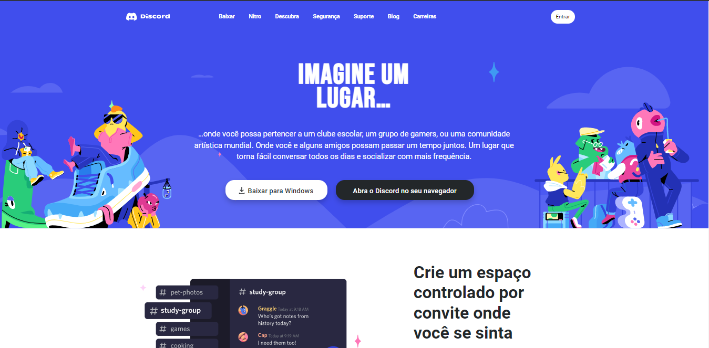

# Discord Front-End

<h1 align="center"> Discord Front-End</h1>

## Descrição do projeto
<h2 align="center">
    
</h2>

Esse projeto é um "clone" do font-end do discord, costumo utilizar bastante o discord  
então pensei em "cria-lo" para praticar meus conhecimentos de front-end.
Ele possui tanto a página home do discord, quanto as páginas login e registre-se  
para navegar até elas basta clicar em ENTRAR na barra de navegação.

<h2 id="Tecnologias">🛠Tecnologias</h2>
As seguintes ferramentas foram usadas na construção do projeto:

- [HTML](https://developer.mozilla.org/pt-BR/docs/Web/HTML)
- [CSS](https://developer.mozilla.org/pt-BR/docs/Web/CSS)

<h2 id="funcionalidades">⚙️ Funcionalidades</h2>
- [x] Botão entrar e tela de login
- [x] Botão registra-se e tela de registro
- [ ] Responsividade.
- [ ] Botão de back-to-top no canto inferior direito da página.